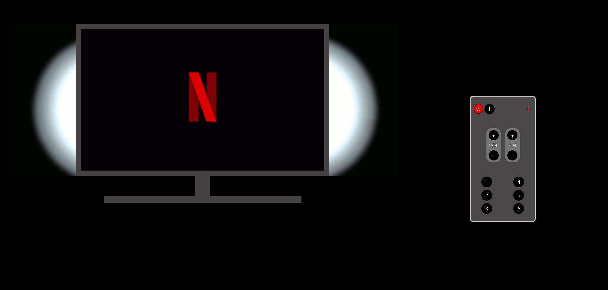
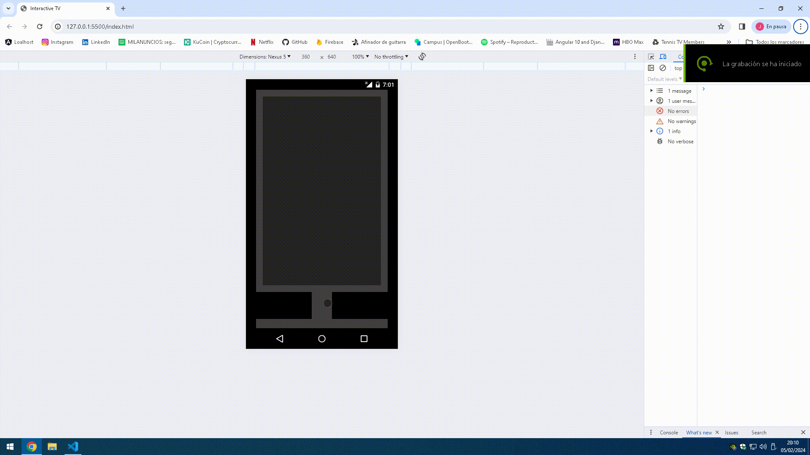
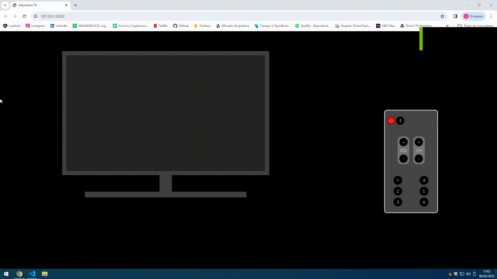

# 📺
# Interactive Smart TV

Hi Geeks! I have made an interactive Smart TV with reactive buttons that affect on the TV Screen

## Index 🧾

- [Technologies ⚙](#technologies-)
- [Page 📺](#page-)
- [Features](#features)
- [Bugs 🐛](#features)
- [Deployment 👁‍🗨](#deployment-)
- [Download ⬇](#download-)
- [Source Code 🔬](#source-code-)
- [Roadmap ❗](#roadmap-)
- [Author 🙍‍♂️](#author-🙍‍♂️)
- [Time of development ⌛](#time-of-development-)


## Technologies ⚙


## Page 📺

### Index.html


**Desktop**



**Mobile**

## Features

- **PowerButton:** Press the button to turn on or turn off the TV,when you turn on the TV you will see a guide  with all the channels that you can watch 🛎
**Demo:**

- **Red light LED:** Small LED that turns red when the Tv is ON 🔴
- **InfoButton:** Press this button to see the channel info and the current hour ℹ

- **Volume buttons pad:** 2 buttons to increment and decrease the volume level 🔈   

- **Channel buttons pad:** 2 buttons to switch the channels 🛎  

- **Channel buttons:** 6 buttons if you want to visit an specific channel 🛎

- **Background light Tv:** Background white light that turns on when you turn ON the TV

## Bugs 🐛

- **Volume Buttons pad:** Sometimes you cant increment or decrease the volume if you have pressed the button before,you must wait a few seconds and the button will be available

- **Problems with the first channel:** Sometimes when you press the button that leads you to the first channel,it´s not shown


## Deployment 👁‍🗨

You can interact with this TV fllowing the next url:

> [https://frr95.github.io/Proyecto-TV-interactiva/]

And also my commits in this url:

> [https://github.com/FRR95/Proyecto-TV-interactiva/commits/master/]


## Download ⬇

Enjoy yourself with this project in your local storage adding this command in your terminal

```sh
git clone https://github.com/FRR95/Proyecto-TV-interactiva.git
```

## Source Code 🔬

**HTML**
```sh
<!DOCTYPE html>
<html lang="en">

<head>
    <meta charset="UTF-8">
    <meta name="viewport" content="width=device-width, initial-scale=1.0">
    <title>Interactive TV</title>
    <script src="https://cdn.jsdelivr.net/npm/bootstrap@5.3.2/dist/js/bootstrap.bundle.min.js"
        integrity="sha384-C6RzsynM9kWDrMNeT87bh95OGNyZPhcTNXj1NW7RuBCsyN/o0jlpcV8Qyq46cDfL"
        crossorigin="anonymous"></script>


    <link href="https://cdn.jsdelivr.net/npm/bootstrap@5.3.2/dist/css/bootstrap.min.css" rel="stylesheet"
        integrity="sha384-T3c6CoIi6uLrA9TneNEoa7RxnatzjcDSCmG1MXxSR1GAsXEV/Dwwykc2MPK8M2HN" crossorigin="anonymous">
    <link rel="stylesheet" href="https://cdn.jsdelivr.net/npm/bootstrap-icons@1.11.3/font/bootstrap-icons.min.css">
    <link rel="stylesheet" href="css/styles.css">
</head>

<body>


    <!-- SECTION CONTENT -->

    <section id="content" class="col row  d-flex  justify-content-center align-items-center">

        <!-- TV SECTION -->


        <!-- row-xs-6 row-sm-6 col-md-8 col-lg-8  to responsive structure -->

        <div id="TvSection"
            class="col row row-xs-6 row-sm-6 col-md-8 col-lg-8   d-flex  justify-content-center align-items-center TvBackgroundlightOff">
            <div class="row d-flex  justify-content-center align-items-center">
                <div id="TvSectionTop" class="row-4 d-flex  justify-content-center align-items-center">
                    <div id="TvScreen" class="row  d-flex justify-content-center align-items-center ScreenBlack">
                        <!-- SCREEN INFO SECTIONS -->
                        <div id="ScreenInfo1" class=" row   justify-content-center  ">
                            <div id="TvScreenContentTop"
                                class="row-2 container-fluid d-flex justify-content-center align-items-center">
                                <div class="col d-flex justify-content-center align-items-center">
                                    <div
                                        class=" channelinfo col-4 d-flex justify-content-center align-items-center text-center me-2">
                                        <h4>Canal Netflix</h4>
                                    </div>
                                    <div id="dateinfo"
                                        class=" channelinfo dateinfo col-4 d-flex justify-content-center align-items-center text-center">
                                        <h4>Fecha</h4>
                                    </div>
                                    <div id="hourinfo"
                                        class=" channelinfo dateinfo col-4 d-flex justify-content-center ms-2 align-items-center text-center">
                                        <h4>Fecha</h4>
                                    </div>
                                </div>
                            </div>
                            <div id="TvScreenContentMid"
                                class="row-8 container-fluid d-flex justify-content-center align-items-center">

                            </div>
                            <div id="TvScreenContentBottom"
                                class="container-fluid row-2 d-flex justify-content-center align-items-center">
                                <div class=" col d-flex justify-content-center align-items-center">
                                    <div id="TvScreenContentBottomTop"
                                        class=" col-3 d-flex  justify-content-center align-items-center bv">

                                    </div>
                                    <div id="TvScreenContentBottommid"
                                        class=" col-6 d-flex  justify-content-center align-items-center bv">

                                    </div>
                                    <div id="TvScreenContentBottomBottom"
                                        class=" col-3 d-flex  justify-content-center align-items-center bv">

                                    </div>
                                </div>
                            </div>
                        </div>

                        <div id="ScreenInfo2" class=" row   justify-content-center  ">
                            <div id="TvScreenContentTop"
                                class="row-2 container-fluid d-flex justify-content-center align-items-center">
                                <div class="col d-flex justify-content-center align-items-center">
                                    <div
                                        class="channelinfo col-4 d-flex justify-content-center align-items-center me-2">
                                        <h4>Canal HBO</h4>
                                    </div>
                                    <div id="dateinfo1"
                                        class="channelinfo col-4 d-flex justify-content-center align-items-center">
                                        <h4>Fecha</h4>
                                    </div>

                                    <div id="hourinfo1"
                                        class=" channelinfo dateinfo col-4 d-flex justify-content-center ms-2  align-items-center text-center">
                                        <h4>Fecha</h4>
                                    </div>

                                </div>
                            </div>
                            <div id="TvScreenContentMid"
                                class="row-8 container-fluid d-flex justify-content-center align-items-center">

                            </div>
                            <div id="TvScreenContentBottom"
                                class="container-fluid row-2 d-flex justify-content-center align-items-center">
                                <div class=" col d-flex justify-content-center align-items-center">
                                    <div id="TvScreenContentBottomTop"
                                        class=" col-3 d-flex  justify-content-center align-items-center bv">

                                    </div>
                                    <div id="TvScreenContentBottommid"
                                        class=" col-6 d-flex  justify-content-center align-items-center bv">

                                    </div>
                                    <div id="TvScreenContentBottomBottom"
                                        class=" col-3 d-flex  justify-content-center align-items-center bv">

                                    </div>
                                </div>
                            </div>
                        </div>
                        <div id="ScreenInfo3" class=" row   justify-content-center  ">
                            <div id="TvScreenContentTop"
                                class="row-2 container-fluid d-flex justify-content-center align-items-center">
                                <div class="col d-flex justify-content-center align-items-center">
                                    <div
                                        class="channelinfo col-4 d-flex justify-content-center align-items-center me-2">
                                        <h4>Canal Amazon Prime</h4>
                                    </div>
                                    <div id="dateinfo2"
                                        class="channelinfo col-4 d-flex justify-content-center align-items-center">
                                        <h4>Fecha</h4>
                                    </div>

                                    <div id="hourinfo2"
                                        class=" channelinfo dateinfo col-4 d-flex justify-content-center ms-2 align-items-center text-center">
                                        <h4>Fecha</h4>
                                    </div>

                                </div>
                            </div>
                            <div id="TvScreenContentMid"
                                class="row-8 container-fluid d-flex justify-content-center align-items-center">

                            </div>
                            <div id="TvScreenContentBottom"
                                class="container-fluid row-2 d-flex justify-content-center align-items-center">
                                <div class=" col d-flex justify-content-center align-items-center">
                                    <div id="TvScreenContentBottomTop"
                                        class=" col-3 d-flex  justify-content-center align-items-center bv">

                                    </div>
                                    <div id="TvScreenContentBottommid"
                                        class=" col-6 d-flex  justify-content-center align-items-center bv">

                                    </div>

                                    <div id="TvScreenContentBottomBottom"
                                        class=" col-3 d-flex  justify-content-center align-items-center bv">

                                    </div>
                                </div>
                            </div>
                        </div>
                        <div id="ScreenInfo4" class=" row   justify-content-center  ">
                            <div id="TvScreenContentTop"
                                class="row-2 container-fluid d-flex justify-content-center align-items-center">
                                <div class="col d-flex justify-content-center align-items-center">
                                    <div
                                        class="channelinfo col-4 d-flex justify-content-center align-items-center me-2">
                                        <h4>Canal Deportes</h4>
                                    </div>
                                    <div id="dateinfo3"
                                        class="channelinfo col-4 d-flex justify-content-center align-items-center">
                                        <h4>Fecha</h4>
                                    </div>
                                    <div id="hourinfo3"
                                        class=" channelinfo dateinfo col-4 d-flex justify-content-center ms-2 align-items-center text-center">
                                        <h4>Fecha</h4>
                                    </div>
                                </div>
                            </div>
                            <div id="TvScreenContentMid"
                                class="row-8 container-fluid d-flex justify-content-center align-items-center">

                            </div>
                            <div id="TvScreenContentBottom"
                                class="container-fluid row-2 d-flex justify-content-center align-items-center">
                                <div class=" col d-flex justify-content-center align-items-center">
                                    <div id="TvScreenContentBottomTop"
                                        class=" col-3 d-flex  justify-content-center align-items-center bv">

                                    </div>
                                    <div id="TvScreenContentBottommid"
                                        class=" col-6 d-flex  justify-content-center align-items-center bv">

                                    </div>
                                    <div id="TvScreenContentBottomBottom"
                                        class=" col-3 d-flex  justify-content-center align-items-center bv">

                                    </div>
                                </div>
                            </div>
                        </div>
                        <div id="ScreenInfo5" class=" row   justify-content-center  ">
                            <div id="TvScreenContentTop"
                                class="row-2 container-fluid d-flex justify-content-center align-items-center">
                                <div class="col d-flex justify-content-center align-items-center">
                                    <div
                                        class="channelinfo col-4 d-flex justify-content-center align-items-center me-2">
                                        <h4>Canal Música</h4>
                                    </div>
                                    <div id="dateinfo4"
                                        class="channelinfo col-4 d-flex justify-content-center align-items-center">
                                        <h4>Fecha</h4>
                                    </div>
                                    <div id="hourinfo4"
                                        class=" channelinfo dateinfo col-4 d-flex justify-content-center ms-2 align-items-center text-center">
                                        <h4>Fecha</h4>
                                    </div>

                                </div>
                            </div>
                            <div id="TvScreenContentMid"
                                class="row-8 container-fluid d-flex justify-content-center align-items-center">

                            </div>
                            <div id="TvScreenContentBottom"
                                class="container-fluid row-2 d-flex justify-content-center align-items-center">
                                <div class=" col d-flex justify-content-center align-items-center">
                                    <div id="TvScreenContentBottomTop"
                                        class=" col-3 d-flex  justify-content-center align-items-center bv">

                                    </div>
                                    <div id="TvScreenContentBottommid"
                                        class=" col-6 d-flex  justify-content-center align-items-center bv">

                                    </div>
                                    <div id="TvScreenContentBottomBottom"
                                        class=" col-3 d-flex  justify-content-center align-items-center bv">

                                    </div>
                                </div>
                            </div>
                        </div>

                        <div id="ScreenInfo6" class=" row   justify-content-center  ">
                            <div id="TvScreenContentTop"
                                class="row-2 container-fluid d-flex justify-content-center align-items-center">
                                <div class="col d-flex justify-content-center align-items-center">
                                    <div
                                        class="channelinfo col-4 d-flex justify-content-center align-items-center me-2">
                                        <h4>Canal Cine</h4>
                                    </div>
                                    <div id="dateinfo5"
                                        class="channelinfo col-4 d-flex justify-content-center align-items-center">
                                        <h4>Fecha</h4>
                                    </div>
                                    <div id="hourinfo5"
                                        class=" channelinfo dateinfo col-4 d-flex justify-content-center ms-2 align-items-center text-center">
                                        <h4>Fecha</h4>
                                    </div>

                                </div>
                            </div>
                            <div id="TvScreenContentMid"
                                class="row-8 container-fluid d-flex justify-content-center align-items-center">

                            </div>
                            <div id="TvScreenContentBottom"
                                class="container-fluid row-2 d-flex justify-content-center align-items-center">
                                <div class=" col d-flex justify-content-center align-items-center">
                                    <div id="TvScreenContentBottomTop"
                                        class=" col-3 d-flex  justify-content-center align-items-center bv">

                                    </div>
                                    <div id="TvScreenContentBottommid"
                                        class=" col-6 d-flex  justify-content-center align-items-center bv">

                                    </div>
                                    <div id="TvScreenContentBottomBottom"
                                        class=" col-3 d-flex  justify-content-center align-items-center bv">

                                    </div>
                                </div>
                            </div>
                        </div>

                        <!-- VOLUME SECTION -->

                        <div id="VolumeSection" class="row position-absolute justify-content-center align-items-center">
                            <div id="VolumeBar" class="VolBar     justify-content-center align-items-center bv">
                            </div>
                        </div>
                    </div>

                </div>

                <div id="TvSectionBottom" class="row-7 d-flex  justify-content-center  ">
                    <div class="col d-flex  justify-content-center ">
                        <div id="TvSectionBottomLeft" class="col-5"></div>
                        <div id="TvSectionBottomMid" class="col-2"></div>
                        <div id="TvSectionBottomRight" class="col-5"></div>
                    </div>


                </div>
                <div id="TvSectionBase" class="row-1 d-flex  justify-content-center  ">

                </div>
            </div>
        </div>

        <!-- REMOTE CONTROL SECTION  -->

        <!-- row-xs-6 row-sm-6 col-md-8 col-lg-8  to responsive structure -->

        <div id="remoteControlSection"
            class="  row-xs-6 row-sm-6 col-md-4 col-lg-4 d-flex  justify-content-center align-items-center">
            <div class="row d-flex  justify-content-center align-items-center">
                <div id="remoteControlSectionTop" class="row-8 d-flex  justify-content-center align-items-center">

                </div>

                <div id="remoteControlSectionBottom" class="row-4 d-flex  justify-content-center align-items-center">
                    <div id="RemoteControl" class=" d-flex  justify-content-center ">
                        <div id="remoteControlContent" class="row d-flex justify-content-center align-items-center">
                            <div id="remoteControlContentTop"
                                class=" row-2 d-flex justify-content-center align-items-center">
                                <div class=" col d-flex justify-content-center align-items-center">
                                    <div id="remoteControlContentTopLeft"
                                        class=" col-5 d-flex justify-content-center align-items-center">
                                        <div id="powerButton"
                                            class="d-flex justify-content-center me-1 align-items-center buttonOnOff">
                                            <i class="bi bi-power"></i>
                                        </div>

                                        <div id="SourceButton"
                                            class="d-flex justify-content-center  align-items-center buttonstyle">
                                            <i class="bi bi-info-lg"></i>
                                        </div>
                                    </div>

                                    <div id="remoteControlContentTopRight"
                                        class=" col-7 d-flex justify-content-center align-items-center">
                                        <div id="powerlight"
                                            class="  d-flex justify-content-center align-items-center powerlightoff">

                                        </div>
                                    </div>

                                </div>
                            </div>
                            <div id="remoteControlContentMid"
                                class=" row-2 d-flex justify-content-center align-items-center">
                                <div class="col d-flex justify-content-center align-items-center">
                                    <div class="col-6 d-flex justify-content-center align-items-center">
                                        <div class="ChannelVolumePad row-12 me-2">
                                            <div id="VolumePlus"
                                                class="buttonstyle d-flex justify-content-center align-items-center mb-1">
                                                +
                                            </div>
                                            <div id="" class=" d-flex justify-content-center align-items-center">VOL
                                            </div>
                                            <div id="VolumeMinus"
                                                class="buttonstyle d-flex justify-content-center align-items-center mt-1">
                                                -
                                            </div>
                                        </div>
                                        <div class="  col-6 d-flex justify-content-center align-items-center">
                                            <div class="ChannelVolumePad row-12 ms-2">
                                                <div id="ChannelPlus"
                                                    class="buttonstyle d-flex justify-content-center align-items-center mb-1 text-center">
                                                    <p>+</p>
                                                </div>
                                                <div id="" class=" d-flex justify-content-center align-items-center">CH
                                                </div>
                                                <div id="ChannelMinus"
                                                    class="buttonstyle d-flex justify-content-center align-items-center mt-1">
                                                    -
                                                </div>
                                            </div>
                                        </div>
                                    </div>
                                </div>
                            </div>
                            <div id="remoteControlContentBottom"
                                class="container-fluid d-flex justify-content-center align-items-center">
                                <div class="col d-flex justify-content-center align-items-center">
                                    <div class="col-6 d-flex justify-content-center align-items-center ">
                                        <div class="row-12 ">
                                            <div id="channel1"
                                                class="  button d-flex justify-content-center align-items-center  mb-2">
                                                <p>1</p>
                                            </div>
                                            <div id="channel2"
                                                class=" button d-flex justify-content-center align-items-center">
                                                2
                                            </div>
                                            <div id="channel3"
                                                class=" button d-flex justify-content-center align-items-center mt-2">
                                                3
                                            </div>
                                        </div>
                                    </div>
                                    <div class="col-6 d-flex justify-content-center align-items-center">
                                        <div class="row-12 ">
                                            <div id="channel4"
                                                class="button d-flex justify-content-center align-items-center mb-2">
                                                4
                                            </div>
                                            <div id="channel5"
                                                class="button d-flex justify-content-center align-items-center">5
                                            </div>
                                            <div id="channel6"
                                                class="button d-flex justify-content-center align-items-center mt-2">
                                                6
                                            </div>
                                        </div>
                                    </div>
                                </div>
                            </div>
                        </div>
                    </div>

                </div>
            </div>
        </div>


    </section>
    <script src="https://cdn.jsdelivr.net/npm/@popperjs/core@2.11.8/dist/umd/popper.min.js"
        integrity="sha384-I7E8VVD/ismYTF4hNIPjVp/Zjvgyol6VFvRkX/vR+Vc4jQkC+hVqc2pM8ODewa9r"
        crossorigin="anonymous"></script>

    <script src="https://cdn.jsdelivr.net/npm/bootstrap@5.3.2/dist/js/bootstrap.min.js"
        integrity="sha384-BBtl+eGJRgqQAUMxJ7pMwbEyER4l1g+O15P+16Ep7Q9Q+zqX6gSbd85u4mG4QzX+"
        crossorigin="anonymous"></script>
    <script src="./js/main.js"></script>
</body>
<footer>

</footer>

</html>
```
**JS**
```sh
/////DECLARING THE CONSTANTS/////

const btns = document.getElementsByClassName("button"); //Channel buttons
const btnVolPlus = document.getElementById("VolumePlus"); //Increment Volume
const btnVolMinus = document.getElementById("VolumeMinus"); //Decrease Volume
const btnChPlus = document.getElementById("ChannelPlus"); //Increment Channel
const btnChMinus = document.getElementById("ChannelMinus"); //Decrease Channel
const screenInfo = document.getElementById("ScreenInfo"); //Info HUD
const VolBar = document.getElementById("VolumeBar"); //Volume Bar
const pwrlight = document.getElementById("powerlight"); //Remote control power red LED
const lighttvbackground = document.getElementById("TvSectionTop"); //Background TV 
const sourcebtn = document.getElementById("SourceButton"); //Info Button

///Variables and lets to see the current time via strings

var dateNow = new Date(); ///Variable to obtain the date
var dateNowString = dateNow.toString(); //Variable to switch it to string
let dateNowStringHour = dateNowString.slice(16, 24); //Let to slice the data to obtain only the hour
let day = dateNow.getDate() ///Get only the day of the date in a let
let month = dateNow.getMonth() + 1 ///Get only the month of the date in a let
let year = dateNow.getFullYear() ///Get only the year of the date in a let
let date = `${day}-${month}-${year}` ///Concat all in one

////Inners HTML to send the data to a div tag 

document.getElementById("dateinfo").innerHTML = date;
document.getElementById("dateinfo1").innerHTML = date;
document.getElementById("dateinfo2").innerHTML = date;
document.getElementById("dateinfo3").innerHTML = date;
document.getElementById("dateinfo4").innerHTML = date;
document.getElementById("dateinfo5").innerHTML = date;

document.getElementById("hourinfo").innerHTML = dateNowStringHour;
document.getElementById("hourinfo1").innerHTML = dateNowStringHour;
document.getElementById("hourinfo2").innerHTML = dateNowStringHour;
document.getElementById("hourinfo3").innerHTML = dateNowStringHour;
document.getElementById("hourinfo4").innerHTML = dateNowStringHour;
document.getElementById("hourinfo5").innerHTML = dateNowStringHour;


////DECLARING LETS////

let arrayBtns = Array.from(btns); ////Passing the class "button" list to a array
let TvScreen = document.getElementById("TvScreen"); ////Declaring the TV screen div content
let TvOn = false; ////Boolean let to check if the TV is ON or not
let powerButton = document.getElementById("powerButton"); ////Declaring power button div
let IncreaseDecreaseVolume = 0; ///Incremental and decremental value when you use the + - volume button
let IncreaseDecreaseChannel = 0; ///Incremental and decremental value when you use the + - channel button
let channelValue = 0; ////
let channelinfo; /////let to save the channel info

///When you click the power button 

powerButton.addEventListener("click", () => {
    if (!TvOn) { //If the Tv if off
        TvScreen.classList.remove(TvScreen.classList[TvScreen.classList.length - 1]);
        TvScreen.classList.add("channelDefault"); ////Remove the last class value and put the channel default (Guide list)
        pwrlight.classList.remove(pwrlight.classList[pwrlight.classList.length - 1]);
        pwrlight.classList.add("powerlighton"); ////Turn ON the power red LED
        lighttvbackground.classList.remove(lighttvbackground.classList[lighttvbackground.classList.length - 1]);
        lighttvbackground.classList.add("TvBackgroundlightOn");//////Adds light in the TV Background 
        TvOn = true;
    }
    else { //If the Tv is On
        TvScreen.classList.remove(TvScreen.classList[TvScreen.classList.length - 1]);
        TvScreen.classList.add("ScreenBlack");////Turns Off the screen 
        pwrlight.classList.remove(pwrlight.classList[pwrlight.classList.length - 1]);
        pwrlight.classList.add("powerlightoff");////Turn Off the power red LED
        lighttvbackground.classList.remove(lighttvbackground.classList[lighttvbackground.classList.length - 1]);
        lighttvbackground.classList.add("TvBackgroundlightOff");////Turn off the light TV Background
        TvOn = false;////boolean to save that the Tv if off in this moment
        IncreaseDecreaseChannel = 0;////reset the incresese decrease channel valie 
        return TvOn; //// Returns the boolena value
    }
})

btnVolPlus.addEventListener("click", () => { ///When you press the + volume button
    if (IncreaseDecreaseVolume <= 4 && TvOn) { ///if the increase decrease let is minor or equal than 4 AND the tv is ON
        IncreaseDecreaseVolume++; /////The value increase
        VolBar.classList.remove(VolBar.classList[VolBar.classList.length - 1]);
        VolBar.classList.add("VolBarLighted" + IncreaseDecreaseVolume.toString());///The volume bar id increases its width removing the old value and adding the new one with the volbar class + the value of the bar
    }
})

btnVolMinus.addEventListener("click", () => { /////The same but opposite
    if (IncreaseDecreaseVolume >= 1 && TvOn) {
        IncreaseDecreaseVolume--;
        VolBar.classList.remove(VolBar.classList[VolBar.classList.length - 1]);
        VolBar.classList.add("VolBarLighted" + IncreaseDecreaseVolume.toString());
    }
})

btnChPlus.addEventListener("click", () => { ///When you press the + channel button
    if (IncreaseDecreaseChannel <= 5 && IncreaseDecreaseChannel + channelValue <= 5 && TvOn) { ////If the incremental decremental value is minor or equal than 5 and the TV is ON
        IncreaseDecreaseChannel += 1; /////Increment the channel value
        TvScreen.classList.remove(TvScreen.classList[TvScreen.classList.length - 1]);
        TvScreen.classList.add("channel" + (IncreaseDecreaseChannel).toString()); /////The channel  increases its number removing the old value class and adding the new one with the channel class + the number of the channel
        channelinfo = ("channel" + (IncreaseDecreaseChannel).toString()); /////this let saves the channel info value if you want to press the info button
    }
})

btnChMinus.addEventListener("click", () => { ////The same but opposite 
    if (IncreaseDecreaseChannel >= 2 && TvOn) {
        IncreaseDecreaseChannel -= 1;
        TvScreen.classList.remove(TvScreen.classList[TvScreen.classList.length - 1]);
        TvScreen.classList.add("channel" + (IncreaseDecreaseChannel).toString());
        channelinfo = ("channel" + (IncreaseDecreaseChannel).toString());
    }
})


sourcebtn.addEventListener("click", () => { ///when you press the channel info button
    if (TvOn) { /////if the TV is On
        TvScreen.classList.remove(TvScreen.classList[TvScreen.classList.length - 1]);
        setTimeout(function () {
            TvScreen.classList.add(channelinfo); ////Remove the previous value and puts the new on to show up in the screen the channel info (i´ve had to put a settimeout because if i dont this function doesn´t work)
        }, 1)
    }

}
)

arrayBtns.map( ////Map all the channel buttons list
    item => { ////declaring arrow function called item
        item.addEventListener("click", (e) => { ////When you one of the mapped channel button list you declare an arrow event called "e" 
            if (TvOn) { //// if the TV is ON
                IncreaseDecreaseChannel = parseInt(e.target.id.slice(-1)); ////saves the value in a the let with a number value with parseInt
                TvScreen.classList.remove(TvScreen.classList[TvScreen.classList.length - 1]);
                TvScreen.classList.add("channel" + e.target.id.slice(-1)); ///Removes the previous class value and puts the new one in the tv screen to show the new channel selected
                channelinfo = ("channel" + e.target.id.slice(-1)); ////Saves the channel info in a let if you want to press the info channel value later
                console.log(TvScreen.classList);
            }
        })
    })
```

**CSS**
```sh
/* COMMON ELEMENTS */

html {
    background-color: black;
}

body {
    margin: 0;
    padding: 0;
    background-color: black;
}

#content {

    margin: 0px;
}

p {
    margin: 0;
    padding: 0;
}


/* TV SECTION */

#TvScreen {

    border: 1em solid rgb(67, 65, 65);
    width: 50em;
    height: 30em;

    font-family: monospace;
    color: rgb(67, 110, 1);
}

.ScreenBlack {
    background-color: rgb(37, 37, 37);
}

.channelDefault {
    background-image: url(./../img/guidechannel.jpg);
    background-attachment: fixed;
    background-repeat: no-repeat;


}

.TvBackgroundlightOff {
    background-color: rgb(0, 0, 0);
}

.TvBackgroundlightOn {
    background-image: url(./../img/flashinglight.gif);

}

/* SCREEN INFO SECTION */

#ScreenInfo1 {

    display: none;
}

#ScreenInfo2 {

    display: none;
}

#ScreenInfo3 {

    display: none;
}

#ScreenInfo4 {

    display: none;
}

#ScreenInfo5 {

    display: none;
}

#ScreenInfo6 {

    display: none;
}

/* At the same time you add this class the Id screen info will be activated */
.channel1 {
    background-image: url(./../img/netflixgif.gif);


    background-size: contain;


    #ScreenInfo1 {
        display: block;
        animation: hideAnimationChannel1 0s ease-in 2s;
        animation-fill-mode: forwards;
    }


}

/* The id dissapears after 2 seconds  */

@keyframes hideAnimationChannel1 {
    to {
        display: none;
        width: 0;
        height: 0;
    }
}


.channel2 {
    background-image: url(./../img/hbogif.gif);
    background-size: contain;


    #ScreenInfo2 {

        display: block;
        animation: hideAnimationChannel2 0s ease-in 2s;
        animation-fill-mode: forwards;
    }
}

@keyframes hideAnimationChannel2 {
    to {
        display: none;
        width: 0;
        height: 0;
    }
}

.channel3 {
    background-image: url(./../img/amazonprimevideogif.gif);

    background-size: contain;


    #ScreenInfo3 {

        display: block;
        animation: hideAnimationChannel3 0s ease-in 2s;
        animation-fill-mode: forwards;
    }
}

@keyframes hideAnimationChannel3 {
    to {
        display: none;
        width: 0;
        height: 0;
    }
}

.channel4 {
    background-image: url(./../img/canaldeportesgif.gif);

    background-size: contain;


    #ScreenInfo4 {

        display: block;
        animation: hideAnimationChannel4 0s ease-in 2s;
        animation-fill-mode: forwards;
    }
}

@keyframes hideAnimationChannel4 {
    to {
        display: none;
        width: 0;
        height: 0;
    }
}

.channel5 {
    background-image: url(./../img/canalmusicagif.gif);

    background-size: contain;


    #ScreenInfo5 {

        display: block;
        animation: hideAnimationChannel5 0s ease-in 2s;
        animation-fill-mode: forwards;
    }
}

@keyframes hideAnimationChannel5 {
    to {
        display: none;
        width: 0;
        height: 0;
    }
}

.channel6 {
    background-image: url(./../img/canalcinegif.gif);

    background-size: contain;

    #ScreenInfo6 {

        display: block;
        animation: hideAnimationChannel6 0s ease-in 2s;
        animation-fill-mode: forwards;
    }
}

@keyframes hideAnimationChannel6 {
    to {
        display: none;
        width: 0;
        height: 0;
    }
}

/* channel info background  */

.channelinfo {
    background-color: #ebebeb;
}


/* VOLUME SECTION  */

#VolumeSection {
    margin-top: 18em;
}

.VolBar {
    width: 2em;
    height: 2em;
    border: 0.2px solid black;
    margin: 1em;
    display: none;
    animation: hideAnimationVolumeMuted 0s ease-in 2s;
    animation-fill-mode: forwards;
}


.VolBar.VolBarLighted1 {
    background-color: chartreuse;
    width: 3em;
    display: block;
    animation: hideAnimationVolume 0s ease-in 2s;
    animation-fill-mode: forwards;
}


.VolBar.VolBarLighted2 {
    background-color: rgb(99, 196, 2);
    width: 5em;
    display: block;
    animation: hideAnimationVolume1 0s ease-in 2s;
    animation-fill-mode: forwards;
}

.VolBar.VolBarLighted3 {
    background-color: rgb(67, 134, 0);
    width: 7em;
    display: block;
    animation: hideAnimationVolume2 0s ease-in 2s;
    animation-fill-mode: forwards;
}

.VolBar.VolBarLighted4 {
    background-color: rgb(41, 82, 0);
    width: 9em;
    display: block;
    animation: hideAnimationVolume3 0s ease-in 2s;
    animation-fill-mode: forwards;
}

.VolBar.VolBarLighted5 {
    background-color: rgb(31, 61, 0);
    width: 11em;
    display: block;
    animation: hideAnimationVolume4 0s ease-in 2s;
    animation-fill-mode: forwards;
}

/* The volume bar dissapears after 2 seconds */

@keyframes hideAnimationVolumeMuted {
    to {
        display: none;

    }
}

@keyframes hideAnimationVolume {
    to {
        display: none;

    }
}

@keyframes hideAnimationVolume1 {
    to {
        display: none;

    }
}

@keyframes hideAnimationVolume2 {
    to {
        display: none;

    }
}

@keyframes hideAnimationVolume3 {
    to {
        display: none;

    }
}

@keyframes hideAnimationVolume4 {
    to {
        display: none;

    }
}

/* TV SCREEN SECTION  */

#TvScreenContentMid {
    height: 21em;
}

#TvSectionBottom {

    height: 4em;
}

#TvSectionBottomMid {
    background-color: rgb(67, 65, 65);
    width: 3em;
}

#TvSectionBase {
    background-color: rgb(67, 65, 65);
    height: 22px;
    width: 39em;

}

/* REMOTE CONTROL SECTION */


#remoteControlSectionTop {

    height: 18em;
}

#remoteControlSectionBottom {

    padding: 1em;
}

#RemoteControl {
    background-color: rgb(73 71 71);
    border: 3px solid rgb(202, 202, 202);
    border-radius: 0.7em;
    width: 13em;
    height: 25em;
    color: white;
}

.ChannelVolumePad {
    background-color: #757575;
    padding: 0.4em;
    border-radius: 1em;

}

.buttonOnOff {
    width: 1.9em;
    height: 1.9em;
    background-color: rgb(255, 0, 0);
    border-radius: 50%;
    border: 1px solid black;
    transition: 0.2s;

}

.buttonOnOff:hover {
    background-color: rgb(212, 86, 86);
    cursor: pointer;
    transition: 0.2s;
}

.buttonOnOff:active {
    background-color: rgb(255, 0, 0);

}

#powerlight {
    height: 0.5em;
    width: 0.5em;
    border-radius: 50%;
    border: 1px solid black;
    margin-left: 5em;
}

.powerlightoff {
    background-color: grey;
}

.powerlighton {
    background-color: rgb(255, 0, 0);
}

.button {
    width: 2em;
    height: 2em;
    background-color: rgb(0, 0, 0);
    border-radius: 50%;
    border: 1px solid black;
    transition: 0.2s;
    padding: 1em;

}

.button:hover {
    background-color: rgb(88, 87, 87);
    cursor: pointer;
    transition: 0.2s;
}

.button:active {
    background-color: rgb(46, 44, 44);
}

.buttonstyle {
    width: 2em;
    height: 2em;
    background-color: rgb(0, 0, 0);
    border-radius: 50%;
    border: 1px solid black;
    transition: 0.2s;

}

.buttonstyle:hover {
    background-color: rgb(88, 87, 87);
    cursor: pointer;
    transition: 0.2s;
}

/* Active function yhat changes de background button color when you press the button   */

.buttonstyle:active {
    background-color: rgb(46, 44, 44);
}
```

## Roadmap ❗

- **Turn On the TV !!** -First of all turn On the TV because if you dont,the TV wont work


## Author 🙍‍♂️

- **Francisco Rocher Roure** - FullStack Developer
  - [GitHub](https://github.com/FRR95) - [LinkedIn](https://www.linkedin.com/in/franciscorocher/) - [Portfolio](https://franciscorocherdev.com/)


## Time of development ⌛

- One Week